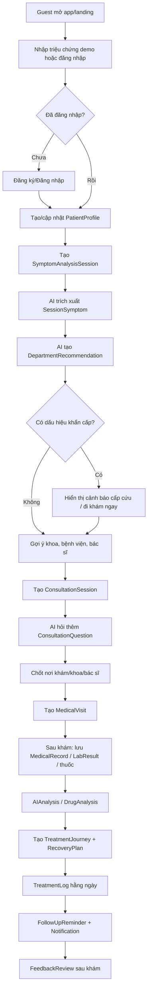

# MediMate AI - Flow & Use Case Theo ERD

Tài liệu này mô tả lại luồng hoạt động của MediMate AI theo ERD hiện tại. Trọng tâm sản phẩm là hỗ trợ người dùng đang có triệu chứng nhưng chưa biết mình có thể gặp vấn đề gì, nên đi khám ở bệnh viện nào, vào khoa nào, cần chuẩn bị gì, và sau khám nên theo dõi điều trị ra sao.

MediMate AI không thay thế bác sĩ. Toàn bộ kết quả AI là định hướng, sàng lọc thông tin, gợi ý chuẩn bị đi khám và hỗ trợ theo dõi. Các tình huống khẩn cấp phải ưu tiên gọi cấp cứu hoặc đến cơ sở y tế gần nhất.

## 1. Mục Tiêu Sản Phẩm

Người dùng chính:
- Người có triệu chứng mới xuất hiện nhưng chưa rõ nên đi khám khoa nào.
- Người muốn tìm cơ sở y tế phù hợp với triệu chứng, vị trí và chuyên khoa.
- Người cần chuẩn bị câu hỏi/thông tin trước khi gặp bác sĩ.
- Người đã đi khám và muốn lưu hồ sơ, toa thuốc, xét nghiệm, theo dõi phục hồi.
- Người đang dùng nhiều thuốc và cần kiểm tra tương tác, hướng dẫn sử dụng an toàn.

Giá trị cốt lõi:
- Nhập triệu chứng bằng ngôn ngữ tự nhiên.
- AI trích xuất triệu chứng, đánh giá mức độ ưu tiên, gợi ý chuyên khoa.
- Gợi ý bệnh viện/phòng khám/khoa/bác sĩ phù hợp.
- Tạo phiên tư vấn chuẩn bị đi khám, hỏi thêm câu hỏi cần thiết.
- Lưu lịch sử đi khám, hồ sơ y tế, kết quả xét nghiệm, thuốc đang dùng.
- Phân tích thuốc, tương tác thuốc, cảnh báo ăn uống/thận trọng.
- Tạo hành trình điều trị, kế hoạch phục hồi, nhật ký theo dõi và nhắc lịch.
- Hỗ trợ subscription để mở khóa giới hạn/tính năng nâng cao.

## 2. Actor Chính

### Guest
Người chưa đăng nhập.

Có thể:
- Xem landing page.
- Dùng demo phân tích triệu chứng giới hạn.
- Xem trang tính năng, bảng giá, disclaimer, chính sách.
- Đăng ký/đăng nhập.

Không thể:
- Lưu phiên phân tích.
- Lưu hồ sơ bệnh nhân.
- Tạo lịch đi khám, hồ sơ y tế, thuốc, journey.

### Patient/User
Người dùng đã đăng nhập, có hồ sơ bệnh nhân.

Có thể:
- Quản lý thông tin tài khoản và `PatientProfile`.
- Tạo phiên phân tích triệu chứng.
- Nhận gợi ý triệu chứng, chuyên khoa, mức độ ưu tiên.
- Nhận gợi ý bệnh viện, khoa, bác sĩ.
- Tạo phiên chuẩn bị tư vấn trước khi đi khám.
- Tạo lịch/lượt khám.
- Lưu hồ sơ y tế, file, kết quả xét nghiệm.
- Quét thuốc, lưu thuốc đang dùng.
- Chạy phân tích tương tác thuốc.
- Theo dõi hành trình điều trị, kế hoạch hồi phục, nhật ký ngày.
- Nhận nhắc lịch và thông báo.
- Đánh giá cơ sở y tế/bác sĩ sau khi khám.
- Mua/nâng cấp gói subscription.

### Staff/Medical Operator
Nhân sự vận hành dữ liệu y tế.

Có thể:
- Quản lý khoa chuyên môn.
- Quản lý cơ sở y tế, khoa trong cơ sở, bác sĩ.
- Kiểm duyệt review.
- Bổ sung nguồn tri thức y khoa nếu được phân quyền.

### Admin
Quản trị hệ thống.

Có thể:
- Quản lý người dùng, role, trạng thái active.
- Quản lý cấu hình AI theo task.
- Quản lý knowledge base.
- Quản lý plan/subscription/payment.
- Theo dõi trạng thái hệ thống, dữ liệu vận hành.

## 3. Nhóm Module Theo ERD

### Account & Permission
Bảng liên quan:
- `AspNetUsers`
- `AspNetRoles`
- `AspNetUserRoles`
- `PatientProfile`
- `RefreshToken`

Mục tiêu:
- Xác thực người dùng.
- Phân quyền User/Staff/Admin.
- Lưu hồ sơ sức khỏe nền tảng của bệnh nhân.

### Symptom Analysis & Department Recommendation
Bảng liên quan:
- `SymptomAnalysisSession`
- `SessionSymptom`
- `MedicalDepartment`
- `DepartmentRecommendation`
- `ConsultationSession`
- `ConsultationQuestion`

Mục tiêu:
- Nhận mô tả triệu chứng.
- AI trích xuất triệu chứng.
- Gợi ý chuyên khoa.
- Đánh giá khẩn cấp.
- Tạo phiên hỏi thêm để chuẩn bị đi khám.

### Healthcare Facilities
Bảng liên quan:
- `MedicalFacility`
- `FacilityDepartment`
- `Doctor`
- `MedicalVisit`
- `FeedbackReview`

Mục tiêu:
- Gợi ý nơi khám phù hợp.
- Liên kết chuyên khoa với cơ sở y tế.
- Gợi ý bác sĩ.
- Lưu lượt khám.
- Thu thập đánh giá sau khám.

### Medical Records & AI Analysis
Bảng liên quan:
- `MedicalRecord`
- `MedicalRecordFile`
- `LabResult`
- `LabResultDetails`
- `AIAnalysis`
- `AISystemConfig`
- `KnowledgeSource`
- `KnowledgeDocument`
- `KnowledgeChunk`

Mục tiêu:
- Lưu hồ sơ y tế.
- Lưu file kết quả/toa thuốc/hình ảnh.
- Phân tích kết quả xét nghiệm.
- Ghi lại prompt/result/disclaimer/model cho mỗi phân tích AI.
- Quản lý nguồn tri thức dùng cho RAG/AI.

### Medication System
Bảng liên quan:
- `Medicine`
- `MedicationScan`
- `MedicationScanResult`
- `UserMedication`
- `DrugAnalysis`
- `DrugAnalysisResult`

Mục tiêu:
- Nhận diện thuốc từ ảnh.
- Lưu thuốc người dùng đang dùng.
- Kiểm tra tương tác thuốc, ăn uống, cách dùng, cảnh báo.

### Treatment Journey
Bảng liên quan:
- `TreatmentJourney`
- `RecoveryPlan`
- `TreatmentLog`
- `FollowUpReminder`
- `Notification`

Mục tiêu:
- Tạo hành trình điều trị sau lượt khám.
- Tạo kế hoạch phục hồi.
- Ghi nhật ký triệu chứng, nhiệt độ, mức đau, uống thuốc.
- AI phản hồi theo log.
- Nhắc lịch và gửi thông báo.

### Billing
Bảng liên quan:
- `SubscriptionPlan`
- `UserSubscription`
- `PaymentTransaction`

Mục tiêu:
- Quản lý gói dịch vụ.
- Giới hạn tính năng.
- Thanh toán/nâng cấp.

## 4. Flow Tổng Thể Cho Người Dùng

## 5. Use Case Chi Tiết

### UC-01 - Đăng ký tài khoản và tạo hồ sơ bệnh nhân

Actor:
- Guest

Mục tiêu:
- Tạo tài khoản để lưu lịch sử phân tích và hồ sơ sức khỏe.

Tiền điều kiện:
- Email chưa tồn tại.

Bảng dữ liệu:
- `AspNetUsers`
- `AspNetUserRoles`
- `PatientProfile`
- `RefreshToken`

Luồng chính:
1. Guest chọn `Đăng ký`.
2. Nhập họ tên, email, số điện thoại, mật khẩu, ngày sinh, giới tính.
3. Hệ thống tạo `AspNetUsers`.
4. Hệ thống gán role mặc định `User`.
5. Người dùng bổ sung hồ sơ bệnh nhân: nhóm máu, chiều cao, cân nặng, dị ứng, bệnh mạn tính, liên hệ khẩn cấp.
6. Hệ thống tạo `PatientProfile`.
7. Hệ thống đăng nhập hoặc yêu cầu đăng nhập lại.

Luồng thay thế:
- Email đã tồn tại -> báo lỗi.
- Mật khẩu không hợp lệ -> báo lỗi.
- Người dùng bỏ qua hồ sơ bệnh nhân -> vẫn cho dùng app nhưng nhắc hoàn thiện profile.

Kỳ vọng UI/UX:
- Form ngắn theo từng bước, không dồn quá nhiều field.
- Thông tin nền y tế có giải thích vì sao cần nhập.
- Có disclaimer dữ liệu sức khỏe nhạy cảm.

### UC-02 - Đăng nhập và duy trì phiên

Actor:
- User/Staff/Admin

Bảng dữ liệu:
- `AspNetUsers`
- `RefreshToken`
- `AspNetRoles`
- `AspNetUserRoles`

Luồng chính:
1. Người dùng nhập email và mật khẩu.
2. Hệ thống xác thực.
3. Hệ thống trả access token và refresh token.
4. FE lưu session.
5. Hệ thống điều hướng theo role:
   - User -> Patient Dashboard.
   - Staff -> Staff Workspace.
   - Admin -> Admin Console.

Luồng thay thế:
- Tài khoản inactive -> báo tài khoản bị khóa/chưa kích hoạt.
- Token hết hạn -> dùng refresh token.
- Refresh token revoked/used -> yêu cầu đăng nhập lại.

### UC-03 - Nhập triệu chứng để AI phân tích

Actor:
- User

Mục tiêu:
- Người dùng mô tả triệu chứng và nhận định hướng ban đầu.

Bảng dữ liệu:
- `SymptomAnalysisSession`
- `SessionSymptom`
- `DepartmentRecommendation`
- `AIAnalysis`
- `AISystemConfig`
- `KnowledgeSource`, `KnowledgeDocument`, `KnowledgeChunk`

Tiền điều kiện:
- User đã đăng nhập.
- User đã thấy disclaimer y tế.

Luồng chính:
1. User mở màn hình `Phân tích triệu chứng`.
2. User nhập mô tả tự nhiên: triệu chứng, thời gian, mức độ, dấu hiệu kèm theo.
3. Hệ thống tạo `SymptomAnalysisSession` với status `Draft`.
4. User xác nhận đã đọc disclaimer.
5. Hệ thống chuyển status sang `Analyzing`.
6. AI đọc `AISystemConfig` task `SymptomAnalysis`.
7. AI trích xuất các triệu chứng chính và lưu vào `SessionSymptom`.
8. AI đánh giá `SeverityLevel`.
9. AI tạo danh sách `DepartmentRecommendation`.
10. Hệ thống chuyển session sang `Completed`.
11. FE hiển thị kết quả.

Kết quả hiển thị:
- Triệu chứng được AI nhận diện.
- Mức độ ưu tiên: nhẹ, cần theo dõi, nên đi khám sớm, khẩn cấp.
- Khoa nên khám.
- Lý do gợi ý.
- Confidence score.
- Cảnh báo nếu có dấu hiệu cấp cứu.
- Câu hỏi cần bổ sung.

Luồng thay thế:
- AI lỗi -> status `Failed`, cho phép thử lại.
- Input quá ngắn -> yêu cầu mô tả thêm.
- Có dấu hiệu nguy hiểm -> hiển thị emergency banner trước mọi gợi ý khác.

Kỳ vọng UI/UX:
- Không dùng ngôn ngữ chẩn đoán chắc chắn như “bạn bị bệnh X”.
- Dùng “có thể liên quan”, “nên kiểm tra”, “nên đi khám”.
- Emergency CTA rõ: gọi cấp cứu / đến bệnh viện gần nhất.

### UC-04 - Nhận gợi ý khoa nên khám

Actor:
- User

Bảng dữ liệu:
- `MedicalDepartment`
- `DepartmentRecommendation`
- `SymptomAnalysisSession`

Luồng chính:
1. Sau khi phân tích triệu chứng hoàn tất, hệ thống hiển thị danh sách khoa.
2. Mỗi khoa có:
   - Tên khoa.
   - Độ phù hợp.
   - Lý do.
   - Thứ tự ưu tiên.
   - Cờ khẩn cấp nếu có.
3. User chọn một khoa để xem cơ sở y tế phù hợp.

Kỳ vọng:
- Có thể có nhiều khoa phù hợp.
- Khoa ưu tiên cao nhất không nhất thiết là kết luận cuối cùng.
- Cho phép user xem giải thích vì sao AI đề xuất.

### UC-05 - Gợi ý bệnh viện/phòng khám phù hợp

Actor:
- User

Mục tiêu:
- Tìm nơi khám phù hợp với khoa được gợi ý.

Bảng dữ liệu:
- `MedicalFacility`
- `FacilityDepartment`
- `MedicalDepartment`
- `Doctor`
- `FeedbackReview`

Luồng chính:
1. User chọn khoa từ `DepartmentRecommendation`.
2. Hệ thống tìm `MedicalFacility` có `FacilityDepartment` tương ứng.
3. Hệ thống lọc cơ sở active.
4. Hệ thống hiển thị danh sách cơ sở y tế:
   - Tên bệnh viện/phòng khám.
   - Địa chỉ.
   - Khoảng cách nếu có vị trí người dùng.
   - Số điện thoại.
   - Website.
   - Giờ mở cửa.
   - Loại cơ sở.
   - Khoa có sẵn.
   - Bác sĩ liên quan.
   - Rating/review nếu có.
5. User chọn cơ sở.

Luồng thay thế:
- Không cho phép lấy vị trí -> hiển thị danh sách theo thành phố/tìm kiếm thủ công.
- Không có cơ sở phù hợp -> đề xuất mở rộng khu vực hoặc chọn khoa khác.
- Triệu chứng khẩn cấp -> ưu tiên cơ sở gần nhất/cấp cứu.

Kỳ vọng UI/UX:
- Map và list đồng bộ.
- Có bộ lọc: khoảng cách, loại cơ sở, giờ mở cửa, khoa, rating.
- Không gợi ý cơ sở inactive.

### UC-06 - Gợi ý bác sĩ trong khoa/cơ sở

Actor:
- User

Bảng dữ liệu:
- `Doctor`
- `FacilityDepartment`
- `MedicalFacility`
- `MedicalDepartment`

Luồng chính:
1. User chọn một cơ sở y tế.
2. Hệ thống hiển thị các bác sĩ thuộc khoa tương ứng.
3. User xem thông tin:
   - Họ tên.
   - Chuyên môn.
   - Học hàm/học vị.
   - Số năm kinh nghiệm.
4. User chọn bác sĩ hoặc bỏ qua nếu chưa biết.

Kỳ vọng:
- Doctor là optional trong `ConsultationSession` và `MedicalVisit`.
- Nếu không có bác sĩ, user vẫn có thể chọn facility + department.

### UC-07 - Phiên tư vấn chuẩn bị đi khám

Actor:
- User

Mục tiêu:
- AI hỏi thêm các câu cần thiết để người dùng chuẩn bị thông tin trước khi đi khám.

Bảng dữ liệu:
- `ConsultationSession`
- `ConsultationQuestion`
- `SymptomAnalysisSession`
- `MedicalFacility`
- `MedicalDepartment`
- `Doctor`
- `AISystemConfig`

Luồng chính:
1. User bấm `Chuẩn bị đi khám`.
2. Hệ thống tạo `ConsultationSession` với status `Draft`.
3. User chọn hoặc xác nhận:
   - Facility.
   - Department.
   - Doctor nếu có.
   - Visit reason.
   - Current symptoms.
4. Hệ thống chuyển status `AIQuestioning`.
5. AI tạo danh sách câu hỏi trong `ConsultationQuestion`.
6. User trả lời hoặc ghi chú.
7. Hệ thống chuyển status `Ready`.
8. FE hiển thị bản tóm tắt chuẩn bị đi khám.

Kết quả hiển thị:
- Lý do đi khám.
- Triệu chứng hiện tại.
- Khoa/cơ sở/bác sĩ dự kiến.
- Câu hỏi cần hỏi bác sĩ.
- Thông tin nên mang theo.
- Dấu hiệu cần đi cấp cứu.

Luồng thay thế:
- User đóng phiên -> status `Closed`.
- User chưa chọn facility -> vẫn tạo bản chuẩn bị chung.

### UC-08 - Tạo lượt khám

Actor:
- User

Bảng dữ liệu:
- `MedicalVisit`
- `MedicalFacility`
- `MedicalDepartment`
- `Doctor`

Luồng chính:
1. User sau khi chọn cơ sở/khoa bấm `Lưu lịch đi khám`.
2. User nhập ngày dự kiến khám.
3. Hệ thống tạo `MedicalVisit` với status `chưa đến`.
4. Sau khi khám xong, user cập nhật status `đã đến`.
5. User có thể nhập diagnosis note nếu bác sĩ đã kết luận.

Kỳ vọng:
- Một visit có thể có facility, department, doctor.
- Visit là mốc để gắn medical record, lab result, feedback, treatment journey.

### UC-09 - Đánh giá sau khám

Actor:
- User

Bảng dữ liệu:
- `FeedbackReview`
- `MedicalVisit`
- `MedicalFacility`
- `Doctor`

Luồng chính:
1. Sau khi `MedicalVisit` status là `đã đến`, hệ thống mời đánh giá.
2. User chọn rating, nhập comment.
3. Hệ thống tạo `FeedbackReview` status `Pending`.
4. Staff/Admin kiểm duyệt.
5. Review chuyển `Published` hoặc `Hidden`.

Kỳ vọng:
- Không cho review nếu chưa có visit hợp lệ.
- Tránh nội dung nhạy cảm hoặc sai lệch y khoa hiển thị công khai.

### UC-10 - Lưu hồ sơ y tế sau khám

Actor:
- User

Bảng dữ liệu:
- `MedicalRecord`
- `MedicalRecordFile`
- `MedicalVisit`

Luồng chính:
1. User mở visit đã khám.
2. Bấm `Thêm hồ sơ y tế`.
3. Chọn record type:
   - LabResult.
   - Prescription.
   - Diagnosis.
   - Imaging.
   - Other.
4. Nhập title, description, record date.
5. Upload file nếu có.
6. Hệ thống tạo `MedicalRecord`.
7. Hệ thống tạo `MedicalRecordFile` cho từng file.

Kỳ vọng:
- File có tên gốc, loại file, URL, thời gian upload.
- Hồ sơ gắn với visit nếu có, hoặc chỉ gắn user nếu user tự upload.

### UC-11 - Phân tích kết quả xét nghiệm

Actor:
- User

Bảng dữ liệu:
- `MedicalRecord`
- `LabResult`
- `LabResultDetails`
- `AIAnalysis`
- `AISystemConfig`
- `KnowledgeSource`, `KnowledgeDocument`, `KnowledgeChunk`

Luồng chính:
1. User upload kết quả xét nghiệm.
2. Hệ thống/OCR trích xuất chỉ số.
3. Tạo `LabResult`.
4. Tạo nhiều `LabResultDetails`.
5. AI phân tích các chỉ số so với normal range.
6. Hệ thống lưu `AIAnalysis` với source type `LabResult`.
7. FE hiển thị:
   - Kết luận tổng quan.
   - Chỉ số bất thường.
   - Ý nghĩa tham khảo.
   - Câu hỏi nên hỏi bác sĩ.

Kỳ vọng:
- Không kết luận bệnh chắc chắn.
- Hiển thị disclaimer.
- Cho phép user liên kết kết quả này vào treatment journey.

### UC-12 - Quét thuốc từ ảnh

Actor:
- User

Bảng dữ liệu:
- `MedicationScan`
- `MedicationScanResult`
- `Medicine`

Luồng chính:
1. User chụp/upload ảnh thuốc hoặc toa thuốc.
2. Hệ thống tạo `MedicationScan` status `Processing`.
3. OCR/AI trích xuất text.
4. Hệ thống match với `Medicine`.
5. Tạo `MedicationScanResult` gồm:
   - MedicineId.
   - Confidence.
   - DetectedName.
   - DetectedDosage.
6. FE hiển thị danh sách thuốc nhận diện.
7. User xác nhận thuốc đúng.

Luồng thay thế:
- Confidence thấp -> yêu cầu user xác nhận thủ công.
- Không tìm thấy thuốc -> cho phép nhập tay.

### UC-13 - Lưu thuốc đang dùng

Actor:
- User

Bảng dữ liệu:
- `UserMedication`
- `Medicine`
- `TreatmentJourney`

Luồng chính:
1. User chọn thuốc từ scan result hoặc tìm thuốc.
2. Nhập hướng dẫn dùng thuốc, ngày bắt đầu, ngày kết thúc.
3. Gắn với treatment journey nếu có.
4. Hệ thống tạo `UserMedication`.

Kỳ vọng:
- Thuốc có status: active, completed, stopped.
- Có thể dùng dữ liệu này cho nhắc lịch và phân tích tương tác.

### UC-14 - Phân tích tương tác thuốc

Actor:
- User

Bảng dữ liệu:
- `DrugAnalysis`
- `DrugAnalysisResult`
- `UserMedication`
- `Medicine`
- `TreatmentJourney`
- `AISystemConfig`

Luồng chính:
1. User chọn `Kiểm tra thuốc`.
2. Hệ thống lấy danh sách `UserMedication` active.
3. Tạo `DrugAnalysis` status `Analyzing`.
4. AI phân tích từng thuốc/kết hợp thuốc.
5. Hệ thống tạo `DrugAnalysisResult`.
6. FE hiển thị:
   - Verdict tổng quan.
   - Chi tiết tương tác.
   - Tương tác với thực phẩm.
   - Cách tối ưu sử dụng.
   - Cảnh báo/thận trọng.
   - Severity.

Luồng thay thế:
- Chỉ có 1 thuốc -> tập trung vào cách dùng, thực phẩm, thận trọng.
- Có tương tác nghiêm trọng -> cảnh báo liên hệ bác sĩ/dược sĩ.

### UC-15 - Tạo hành trình điều trị sau khám

Actor:
- User

Bảng dữ liệu:
- `TreatmentJourney`
- `MedicalVisit`
- `UserMedication`
- `AIAnalysis`

Luồng chính:
1. Sau visit, user bấm `Tạo hành trình điều trị`.
2. Nhập title, diagnosis summary, start date, end date.
3. Hệ thống tạo `TreatmentJourney`.
4. User gắn thuốc đang dùng vào journey.
5. User gắn hồ sơ y tế/lab result liên quan.

Kỳ vọng:
- Mỗi journey thường gắn với một visit.
- Journey có status: active, completed, paused, cancelled.

### UC-16 - Tạo kế hoạch phục hồi

Actor:
- User

Bảng dữ liệu:
- `RecoveryPlan`
- `TreatmentJourney`
- `TreatmentLog`
- `AISystemConfig`

Luồng chính:
1. User mở treatment journey.
2. Chọn tạo recovery plan.
3. Hệ thống/AI gợi ý plan theo số ngày.
4. Tạo `RecoveryPlan` với `IsCurrent = true`.
5. Hệ thống tạo hoặc hướng dẫn tạo `TreatmentLog` theo từng ngày.

Kỳ vọng:
- Một journey có thể có nhiều plan, nhưng chỉ một plan current.
- Plan mới có thể thay thế plan cũ nếu tình trạng thay đổi.

### UC-17 - Ghi nhật ký điều trị hằng ngày

Actor:
- User

Bảng dữ liệu:
- `TreatmentLog`
- `RecoveryPlan`
- `AIAnalysis`

Luồng chính:
1. User mở plan hôm nay.
2. Xem task ngày, thuốc cần dùng.
3. Tick đã uống thuốc.
4. Nhập ghi chú triệu chứng, nhiệt độ, pain level.
5. Hệ thống lưu `TreatmentLog`.
6. AI tạo `AI_FeedbackNote` nếu có dữ liệu đáng chú ý.

Luồng thay thế:
- Nhiệt độ cao/pain level tăng -> cảnh báo liên hệ bác sĩ.
- Quên uống thuốc -> ghi nhận và nhắc lịch.

### UC-18 - Nhắc lịch và thông báo

Actor:
- User
- System

Bảng dữ liệu:
- `FollowUpReminder`
- `Notification`
- `TreatmentJourney`
- `TreatmentLog`

Luồng chính:
1. Khi tạo journey/plan/medication, hệ thống tạo reminder.
2. Đến `ReminderTime`, hệ thống tạo notification.
3. Notification gửi qua channel phù hợp.
4. User mở notification và cập nhật log.
5. Reminder chuyển status sent/completed.

Kỳ vọng:
- Reminder type gồm uống thuốc, tái khám, nhập log, upload kết quả.
- Notification có trạng thái pending/sent/failed/read.

### UC-19 - Nâng cấp subscription

Actor:
- User

Bảng dữ liệu:
- `SubscriptionPlan`
- `UserSubscription`
- `PaymentTransaction`

Luồng chính:
1. User mở bảng giá.
2. Chọn plan.
3. Hệ thống tạo payment transaction.
4. User thanh toán qua provider.
5. Payment success -> tạo/cập nhật `UserSubscription`.
6. App mở khóa tính năng theo `FeatureLimitJson`.

Luồng thay thế:
- Thanh toán thất bại -> transaction status failed, subscription không active.
- Hết hạn -> subscription expired, app quay về giới hạn free.

Kỳ vọng:
- Rõ giới hạn free/premium.
- Không khóa cảnh báo khẩn cấp sau paywall.

## 6. Flow Staff/Admin

### UC-SA01 - Quản lý chuyên khoa

Bảng:
- `MedicalDepartment`

Staff/Admin có thể:
- Tạo khoa.
- Cập nhật mô tả khoa.
- Ẩn/xóa khoa nếu không dùng.

Kỳ vọng:
- Không xóa khoa đang có `FacilityDepartment`, `DepartmentRecommendation`, `MedicalVisit` nếu backend không xử lý cascade an toàn.

### UC-SA02 - Quản lý cơ sở y tế

Bảng:
- `MedicalFacility`
- `FacilityDepartment`
- `Doctor`

Staff/Admin có thể:
- Tạo/sửa/ẩn cơ sở y tế.
- Gán khoa cho cơ sở.
- Thêm/sửa/ẩn bác sĩ.

Kỳ vọng:
- Chỉ gợi ý facility/doctor `IsActive = true`.
- Latitude/Longitude hợp lệ để hiển thị map.

### UC-SA03 - Kiểm duyệt review

Bảng:
- `FeedbackReview`

Staff/Admin có thể:
- Xem review pending.
- Publish nếu hợp lệ.
- Hide nếu vi phạm.

### UC-SA04 - Quản lý AI config

Bảng:
- `AISystemConfig`

Admin có thể:
- Cấu hình prompt theo task:
  - SymptomAnalysis.
  - Consultation.
  - DrugAnalysis.
  - LabResultAnalysis.
  - RecoveryPlan.
- Cấu hình model params.
- Bật/tắt config.

Kỳ vọng:
- Mỗi task active chỉ nên có một config chính.
- Lưu model name/result/disclaimer trong `AIAnalysis`.

### UC-SA05 - Quản lý knowledge base

Bảng:
- `KnowledgeSource`
- `KnowledgeDocument`
- `KnowledgeChunk`

Admin/Medical Operator có thể:
- Thêm nguồn tri thức.
- Đánh trust level.
- Upload/version tài liệu.
- Tạo chunk và embedding reference.

Kỳ vọng:
- AI chỉ dùng source active và đáng tin cậy.
- Có version để truy vết.

## 7. State Machine Quan Trọng

### SymptomAnalysisSession
- `Draft`: vừa tạo, chưa chạy AI.
- `Analyzing`: AI đang phân tích.
- `Completed`: đã có kết quả.
- `Failed`: phân tích lỗi.

### ConsultationSession
- `Draft`: đang chuẩn bị dữ liệu.
- `AIQuestioning`: AI đang hỏi thêm.
- `Ready`: đủ thông tin để đi khám.
- `Closed`: đã đóng phiên.

### MedicalVisit
- `chưa đến`: đã lưu lịch/ý định đi khám.
- `đã đến`: user đã đi khám.

### FeedbackReview
- `Pending`: chờ duyệt.
- `Published`: hiển thị công khai.
- `Hidden`: bị ẩn.

### TreatmentJourney
Gợi ý:
- `Active`
- `Completed`
- `Paused`
- `Cancelled`

### MedicationScan
Gợi ý:
- `Processing`
- `Completed`
- `Failed`
- `NeedsReview`

### DrugAnalysis
Gợi ý:
- `Analyzing`
- `Completed`
- `Failed`

### Notification
Gợi ý:
- `Pending`
- `Sent`
- `Failed`
- `Read`

## 8. Màn Hình Chính Nên Có

### Public
- Landing page.
- Demo triệu chứng giới hạn.
- Pricing.
- Medical disclaimer.
- Login/Register/Forgot password.

### Patient App
- Dashboard tổng quan.
- Hồ sơ bệnh nhân.
- Nhập triệu chứng.
- Kết quả phân tích triệu chứng.
- Gợi ý khoa.
- Gợi ý bệnh viện/map.
- Gợi ý bác sĩ.
- Chuẩn bị đi khám.
- Lượt khám của tôi.
- Hồ sơ y tế.
- Kết quả xét nghiệm.
- Thuốc của tôi.
- Quét thuốc.
- Phân tích tương tác thuốc.
- Hành trình điều trị.
- Kế hoạch phục hồi.
- Nhật ký hằng ngày.
- Nhắc lịch/thông báo.
- Subscription/billing.

### Staff App
- Quản lý chuyên khoa.
- Quản lý cơ sở y tế.
- Quản lý khoa trong cơ sở.
- Quản lý bác sĩ.
- Kiểm duyệt review.

### Admin App
- Quản lý user/role.
- Quản lý AI config.
- Quản lý knowledge base.
- Quản lý subscription plan.
- Quản lý payment transaction.
- Theo dõi hệ thống.

## 9. Checklist Kiểm Thử Theo Luồng Người Dùng

### Guest
- Mở landing desktop/mobile.
- Dùng demo triệu chứng không cần login.
- Từ demo chuyển sang signup/login.
- Mở disclaimer và pricing.

### User mới
- Đăng ký.
- Hoàn thiện patient profile.
- Tạo symptom analysis session.
- Xem kết quả gợi ý khoa.
- Xem cơ sở y tế phù hợp.
- Tạo consultation session.
- Tạo medical visit.

### User sau khi đi khám
- Cập nhật visit status đã đến.
- Upload hồ sơ y tế.
- Nhập kết quả xét nghiệm.
- Chạy AI analysis cho lab result.
- Thêm thuốc đang dùng.
- Chạy drug analysis.
- Tạo treatment journey.
- Tạo recovery plan.
- Ghi treatment log.
- Nhận reminder/notification.
- Đánh giá cơ sở/bác sĩ.

### Staff
- Tạo khoa mới.
- Tạo cơ sở y tế mới.
- Gán khoa cho cơ sở.
- Thêm bác sĩ.
- Ẩn facility/doctor inactive.
- Duyệt review.

### Admin
- Tạo role/user.
- Khóa/mở tài khoản.
- Cấu hình prompt AI.
- Thêm knowledge source/document/chunk.
- Tạo subscription plan.
- Kiểm tra payment transaction.

## 10. Business Rule Cần Khóa Chặt

### Medical safety
- AI không được khẳng định chẩn đoán cuối cùng.
- Kết quả luôn có disclaimer.
- Nếu có dấu hiệu emergency, hiển thị cảnh báo nổi bật trước gợi ý bình thường.
- Không đặt paywall trước cảnh báo khẩn cấp.

### Data privacy
- Hồ sơ sức khỏe là dữ liệu nhạy cảm.
- User chỉ xem dữ liệu của chính mình.
- Staff chỉ xem dữ liệu cần cho nghiệp vụ được phân quyền.
- Admin thao tác phải có audit log nếu có thể.

### Recommendation
- Chỉ gợi ý `MedicalFacility.IsActive = true`.
- Chỉ gợi ý `Doctor.IsActive = true`.
- `DepartmentRecommendation.PriorityRank = 1` là lựa chọn ưu tiên nhất nhưng không phải kết luận y khoa.

### Visit & Review
- Review phải gắn với visit.
- Review mặc định pending.
- Chỉ published review mới hiển thị công khai.

### Treatment
- Một `TreatmentJourney` thường gắn với một `MedicalVisit`.
- Một journey có thể có nhiều recovery plan.
- Chỉ một recovery plan nên có `IsCurrent = true`.
- Treatment log phải theo day number hoặc ngày cụ thể.

### Subscription
- Free user vẫn được dùng tính năng lõi an toàn.
- Premium mở rộng giới hạn, phân tích sâu, lịch sử dài hơn, báo cáo nâng cao.
- Feature limit nên đọc từ `SubscriptionPlan.FeatureLimitJson`.

## 11. Khoảng Cách Giữa ERD Và API Hiện Có

Swagger hiện tại mới thể hiện các nhóm:
- Auth.
- MedicalDepartments.
- Users.

ERD mô tả thêm nhiều module lớn chưa thấy trong Swagger hiện tại:
- Symptom analysis session.
- Consultation session/question.
- Medical facility/facility department/doctor.
- Medical visit.
- Feedback review.
- Medical record/file/lab result.
- AI analysis/system config/knowledge base.
- Medicine/medication scan/user medication/drug analysis.
- Treatment journey/recovery plan/treatment log/reminder/notification.
- Subscription/payment.

Vì vậy khi triển khai tiếp cần bổ sung API theo module, ví dụ:
- `POST /api/symptom-analysis-sessions`
- `GET /api/symptom-analysis-sessions/{id}`
- `POST /api/symptom-analysis-sessions/{id}/analyze`
- `GET /api/symptom-analysis-sessions/{id}/department-recommendations`
- `GET /api/medical-facilities?departmentId=&lat=&lng=`
- `GET /api/facility-departments`
- `GET /api/doctors?facilityDepartmentId=`
- `POST /api/consultation-sessions`
- `POST /api/medical-visits`
- `POST /api/medical-records`
- `POST /api/medication-scans`
- `POST /api/drug-analyses`
- `POST /api/treatment-journeys`
- `POST /api/recovery-plans`
- `POST /api/treatment-logs`
- `GET /api/notifications`
- `POST /api/subscriptions/checkout`

## 12. MVP Đề Xuất Theo Thứ Tự Triển Khai

### MVP 1 - Triage & Hospital Recommendation
Ưu tiên cao nhất:
1. Auth + PatientProfile.
2. SymptomAnalysisSession.
3. SessionSymptom.
4. MedicalDepartment.
5. DepartmentRecommendation.
6. MedicalFacility.
7. FacilityDepartment.
8. Doctor.
9. ConsultationSession.
10. MedicalVisit.

Mục tiêu:
- User nhập triệu chứng.
- AI gợi ý khoa.
- App gợi ý bệnh viện/khoa/bác sĩ.
- User lưu kế hoạch đi khám.

### MVP 2 - Medical Record & Post-Visit
1. MedicalVisit status.
2. MedicalRecord.
3. MedicalRecordFile.
4. LabResult.
5. LabResultDetails.
6. AIAnalysis cho lab result.
7. FeedbackReview.

### MVP 3 - Medication & Treatment Journey
1. Medicine.
2. MedicationScan.
3. UserMedication.
4. DrugAnalysis.
5. TreatmentJourney.
6. RecoveryPlan.
7. TreatmentLog.
8. Reminder/Notification.

### MVP 4 - Billing & Advanced AI
1. SubscriptionPlan.
2. UserSubscription.
3. PaymentTransaction.
4. AISystemConfig UI.
5. Knowledge base management.

